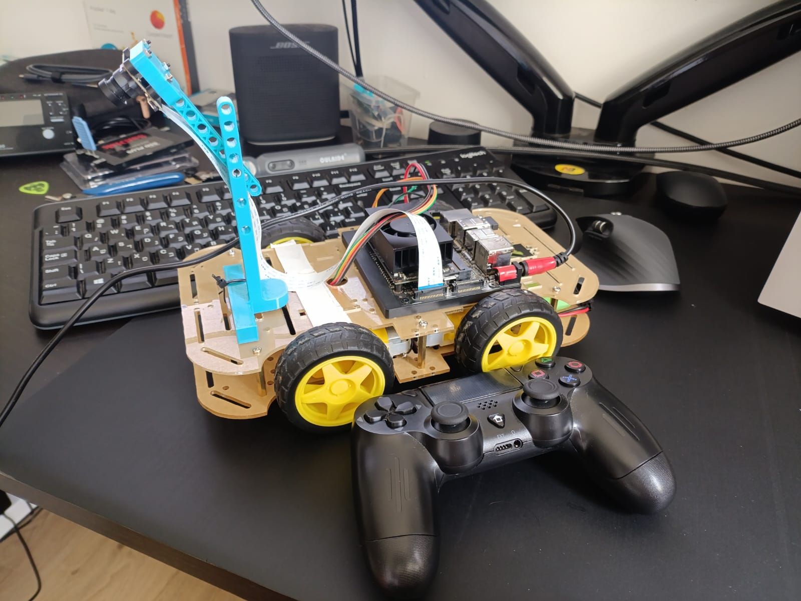

🚗 Autonomous Car Project - Jetson Xavier NX


A comprehensive autonomous car project built with ROS2 Foxy on NVIDIA Jetson Xavier NX. Features real-time joystick control, **seamless autonomous/manual mode switching**, differential drive motor control, CSI camera integration, **web-based camera streaming**, **intelligent joystick-triggered data recording**, **graceful HOME button shutdown**, **command smoothing for stable autonomous driving**, and expandable architecture for autonomous navigation capabilities.


*The completed autonomous car with Jetson Xavier NX, 4-motor differential drive, CSI camera, and Bluetooth joystick control*

## 🎯 Project Overview

This project transforms a basic RC car into an intelligent autonomous vehicle using:
- **NVIDIA Jetson Xavier NX** for high-performance edge computing
- **ROS2 Foxy** for robust robotics software architecture
- **Differential drive control** for precise movement
- **CSI Camera integration** with hardware-accelerated pipeline
- **Web-based camera streaming** for remote monitoring from any device
- **Intelligent joystick control** with one-button recording and graceful shutdown
- **🤖 Seamless Autonomous/Manual Mode Switching** with A/X button toggle
- **🎯 Command Smoothing System** for stable autonomous driving performance
- **📊 Data Augmentation Tools** for improving AI models without retraining
- **Smart data collection system** with automatic session management and compression
- **Production-ready workflow** with complete system shutdown via HOME button
- **Modular design** ready for autonomous navigation features

## ✨ Features

- ✅ **Manual Control**: Bluetooth joystick teleoperation with Xbox/PS4 controller support
- ✅ **🤖 Autonomous Mode**: One-button switching between manual and autonomous control
- ✅ **🎯 Command Smoothing**: Anti-jerk system for stable autonomous driving
- ✅ **🔮 Predictive Steering**: Lookahead system for early turn anticipation
- ✅ **⚡ Burst Control**: Prevents oversteering with manual-like command patterns
- ✅ **🎛️ Decisive Thresholding**: Binary steering decisions for human-like behavior
- ✅ **🔄 Asymmetric Turn Control**: Direction-specific parameters to fix overshoot issues
- ✅ **📊 Smart Model Improvement**: Data augmentation and fine-tuning without retraining
- ✅ **Motor Control**: Precise PWM-based differential drive control with 4-motor setup
- ✅ **Camera Integration**: CSI camera with GStreamer hardware acceleration and configurable flip
- ✅ **Real-time Vision**: Live camera feed publishing to ROS2 topics at up to 60fps
- ✅ **🌐 Web Camera Streaming**: Remote camera access from any device on the network
- ✅ **Intelligent Data Collection**: One-button recording with Square button, automatic session management
- ✅ **Graceful System Shutdown**: HOME button provides complete, clean system termination
- ✅ **Automatic Compression**: ZSTD compression for efficient storage of training data
- ✅ **Quality Monitoring**: Real-time FPS tracking, message counting, and session statistics
- ✅ **One-Command Launch**: Complete system startup with camera, recorder, and web stream enabled by default
- ✅ **Production Workflow**: Battle-tested recording and shutdown system for serious data collection
- ✅ **Safety Systems**: Emergency stop, speed limiting, mode switching, and resource cleanup
- ✅ **Real-time Performance**: Low-latency control loop for responsive driving
- ✅ **Modular Architecture**: Clean ROS2 package structure for easy expansion
- ✅ **PWM Configuration**: Hardware PWM on both motor sides with device tree optimization
- ✅ **🔄 Intelligent Command Relay**: Seamless switching between manual/autonomous control sources
- 🚧 **Lane Detection**: OpenCV-based computer vision (in development)
- 🚧 **Autonomous Navigation**: PID control and path planning (planned)

## 🔧 Hardware Requirements

### Core Components
- **NVIDIA Jetson Xavier NX** Developer Kit
- **CSI Camera** (IMX219 or compatible) or USB webcam
- **4 DC Motors** (2 per side) with H-bridge motor drivers
- **Bluetooth Joystick** (Xbox One, PS4, or compatible)
- **Power Supply** (12V for motors, 5V for Jetson)

### Optional Components
- **IMU Sensor** for orientation tracking
- **Ultrasonic Sensors** for obstacle detection
- **Servo Motor** for camera gimbal

## 📋 Pin Configuration

### Jetson Xavier NX GPIO (BOARD numbering)

| Component | Pin | Function |
|-----------|-----|----------|
| **Left Side Motors** | 18, 16 | Direction Control |
| | 15 | PWM Speed Control |
| **Right Side Motors** | 35, 37 | Direction Control |
| | 32 | PWM Speed Control |
| **CSI Camera** | CSI Connector | Camera Interface |

> **Note**: Pins 15 and 32 are hardware PWM-capable pins on the Jetson Xavier NX. Enable PWM in device tree with `sudo /opt/nvidia/jetson-io/jetson-io.py`

## 🚀 Installation

### Prerequisites

```bash
# Install ROS2 Foxy (if not already installed)
sudo apt update
sudo apt install ros-foxy-desktop

# Install joystick support
sudo apt install ros-foxy-joy ros-foxy-teleop-twist-joy

# Install camera and vision packages
sudo apt install ros-foxy-cv-bridge ros-foxy-image-transport
sudo apt install python3-opencv

# Install GPIO library
sudo apt install python3-rpi.gpio

# Install development tools
sudo apt install python3-colcon-common-extensions

# Install data collection dependencies
sudo apt install ros-foxy-rosbag2* ros-foxy-image-view

# Install ML/AI dependencies for autonomous mode
sudo apt install python3-numpy python3-pandas python3-sklearn
```

### Python Dependencies

Install Python dependencies using the included requirements file:

```bash
# Install Python packages
pip3 install -r requirements.txt

# Additional system packages for data processing
pip3 install zstandard  # For compressed bag support

# ML/AI packages for autonomous mode
pip3 install tensorflow  # or pytorch, depending on your model
pip3 install opencv-python
```

**📄 See [requirements.txt](requirements.txt) for complete dependency list**

### Setup GPIO and PWM Configuration

```bash
# Enable PWM pins in device tree
sudo /opt/nvidia/jetson-io/jetson-io.py
# Select "Configure for compatible hardware" and enable all PWM functions

# Add user to GPIO group
sudo usermod -a -G gpio $USER

# Logout and login again, or reboot
sudo reboot
```

### Clone and Build

```bash
# Create workspace
mkdir -p ~/car_ws/src
cd ~/car_ws

# Clone repository
git clone https://github.com/antonagafonov/autonomous-car-jetson-nx.git src/

# Install dependencies
rosdep install --from-paths src --ignore-src -r -y

# Build workspace
colcon build --symlink-install

# Source workspace
source install/setup.bash
echo "source ~/car_ws/install/setup.bash" >> ~/.bashrc
```

## 🚀 Usage

### Quick Start - One Command Launch

**Take Image from terminal:**
```bash
gst-launch-1.0 nvarguscamerasrc sensor-id=0 num-buffers=1 \
! 'video/x-raw(memory:NVMM),width=1920,height=1080,format=NV12' \
! nvvidconv \
! 'video/x-raw, format=I420' \
! jpegenc \
! filesink location=capture.jpg
```

**Launch complete system (recommended - camera, recording, and web streaming enabled by default):**
```bash
source ~/car_ws/install/setup.bash
ros2 launch car_bringup car_manual_control.launch.py
```

**Launch with custom settings:**
```bash
# Basic launch with custom framerate
ros2 launch car_bringup car_manual_control.launch.py framerate:=10

# Disable camera if not needed
ros2 launch car_bringup car_manual_control.launch.py enable_camera:=false

# Disable recorder if not needed
ros2 launch car_bringup car_manual_control.launch.py enable_recorder:=false

# Disable web streaming if not needed
ros2 launch car_bringup car_manual_control.launch.py enable_web_streamer:=false

# Conservative settings for testing
ros2 launch car_bringup car_manual_control.launch.py \
  max_linear_speed:=0.5 base_speed_scale:=40

# High performance with custom camera resolution and web streaming
ros2 launch car_bringup car_manual_control.launch.py \
  framerate:=60 \
  camera_width:=1920 camera_height:=1080 \
  output_width:=960 output_height:=540 \
  web_quality:=85 web_port:=8080

# Custom web streaming settings
ros2 launch car_bringup car_manual_control.launch.py \
  web_port:=9090 \
  web_quality:=70 \
  web_max_width:=1280 \
  web_max_height:=720
```

### 🤖 Autonomous Mode Operation

The system features seamless switching between manual joystick control and autonomous AI-driven navigation.

#### **Quick Autonomous Setup**

```bash
# 1. Launch the base system
ros2 launch car_bringup car_manual_control.launch.py

# 2. In another terminal, start your inference node
ros2 run car_inference inference_node --ros-args -p max_linear_velocity:=1.5

# 3. Use A/X button on joystick to toggle between modes
# 🎮 Manual mode: Joystick control active
# 🤖 Autonomous mode: AI model control active
```

#### **Advanced Autonomous Configuration**

```bash
# Start inference node with command smoothing (recommended)
ros2 run car_inference inference_node --ros-args \
  -p max_linear_velocity:=1.0 \
  -p max_angular_velocity:=2.0 \
  -p smoothing_alpha:=0.7

# Conservative autonomous mode for testing
ros2 run car_inference inference_node --ros-args \
  -p max_linear_velocity:=0.6 \
  -p smoothing_alpha:=0.5

# High performance autonomous mode
ros2 run car_inference inference_node --ros-args \
  -p max_linear_velocity:=1.5 \
  -p max_angular_velocity:=3.0 \
  -p smoothing_alpha:=0.8

# Advanced burst control with predictive steering
ros2 run car_inference inference_node --ros-args \
  -p max_linear_velocity:=0.7 \
  -p max_angular_velocity:=2.0 \
  -p prediction_skip_count:=2 \
  -p angular_command_threshold:=0.5 \
  -p burst_steer_count:=2 \
  -p burst_zero_count:=3 \
  -p max_steer_bursts:=5 \
  -p forced_straight_count:=10

# Fix right turn overshoot with asymmetric parameters
ros2 run car_inference inference_node --ros-args \
  -p max_linear_velocity:=0.7 \
  -p max_angular_velocity:=2.0 \
  -p prediction_skip_count:=2 \
  -p angular_command_threshold:=0.5 \
  -p right_turn_threshold:=0.3 \
  -p right_turn_skip_count:=1 \
  -p burst_steer_count:=2 \
  -p max_steer_bursts:=5
```

#### **Advanced Inference Parameters**

| Parameter | Range | Description |
|-----------|-------|-------------|
| `smoothing_alpha` | 0.0-1.0 | Smoothing strength (0.5=very smooth, 0.9=responsive) |
| `max_linear_velocity` | 0.1-2.0 | Maximum forward/backward speed (m/s) |
| `max_angular_velocity` | 0.1-5.0 | Maximum turning speed (rad/s) |
| `prediction_skip_count` | 0-5 | **Skip first N predictions for lookahead anticipation** |
| `angular_command_threshold` | 0.0-1.0 | **Zero commands below threshold for decisive steering** |
| `burst_steer_count` | 1-10 | **Steering commands per burst** |
| `burst_zero_count` | 1-10 | **Zero commands between steering bursts** |
| `max_steer_bursts` | 1-20 | **Max steering bursts before forced straight** |
| `forced_straight_count` | 5-30 | **Commands to force straight after max bursts** |
| `right_turn_threshold` | 0.0-1.0 | **Lower threshold for right turns (overshoot fix)** |
| `right_turn_skip_count` | 0-5 | **Different lookahead for right turns** |
| `command_history_size` | 10-100 | **Commands stored in history for analysis** |

**Recommended parameter combinations:**

- **Learning phase**: `smoothing_alpha:=0.5`, `burst_steer_count:=2`, `max_steer_bursts:=3` (very stable)
- **Testing phase**: `smoothing_alpha:=0.7`, `prediction_skip_count:=2`, `angular_command_threshold:=0.5` (balanced)
- **Performance phase**: `smoothing_alpha:=0.9`, `prediction_skip_count:=3`, `burst_steer_count:=3` (responsive)
- **Right turn fix**: `right_turn_threshold:=0.3`, `right_turn_skip_count:=1` (asymmetric tuning)

### 🎯 **Advanced Autonomous Features**

#### **Predictive Lookahead Steering**
The inference node uses future predictions instead of immediate responses for better corner anticipation:

```bash
# Use 2-step lookahead for earlier turn initiation
ros2 run car_inference inference_node --ros-args \
  -p prediction_skip_count:=2

# Conservative lookahead for testing
ros2 run car_inference inference_node --ros-args \
  -p prediction_skip_count:=1

# No lookahead (reactive steering)
ros2 run car_inference inference_node --ros-args \
  -p prediction_skip_count:=0
```

**How it works:**
```
Model predictions: [now, +1step, +2step, +3step, ...]
Skip count = 2:   [SKIP, SKIP,  USE,   USE,   ...]
Result: Car anticipates turns 2 steps ahead instead of reacting late
```

#### **Burst Steering Control**
Prevents oversteering by limiting consecutive steering commands, mimicking manual driving patterns:

```bash
# Conservative burst control (like manual driving)
ros2 run car_inference inference_node --ros-args \
  -p burst_steer_count:=2 \
  -p burst_zero_count:=3 \
  -p max_steer_bursts:=5 \
  -p forced_straight_count:=10

# Pattern: [steer, steer, zero, zero, zero] x5 → [zero, zero, zero...] x10
```

**Burst control prevents:**
- Continuous steering that leads to overshoot
- Oscillatory behavior around corners  
- Cumulative steering errors

#### **Decisive Command Thresholding**
Eliminates weak steering commands for more human-like binary decisions:

```bash
# Decisive steering (either steer or go straight)
ros2 run car_inference inference_node --ros-args \
  -p angular_command_threshold:=0.5

# Very decisive (only strong commands pass)
ros2 run car_inference inference_node --ros-args \
  -p angular_command_threshold:=0.8
```

**Effect:**
```
Model output: 0.3  → Threshold 0.5 → Result: 0.0 (go straight)
Model output: 0.7  → Threshold 0.5 → Result: 0.7 (steer decisively)
```

#### **Asymmetric Turn Handling**
Fixes right turn overshoot with direction-specific parameters:

```bash
# More sensitive right turns
ros2 run car_inference inference_node --ros-args \
  -p angular_command_threshold:=0.5 \
  -p right_turn_threshold:=0.3 \
  -p prediction_skip_count:=2 \
  -p right_turn_skip_count:=1

# Left turns: 0.5 threshold, 2-step lookahead
# Right turns: 0.3 threshold, 1-step lookahead
```

#### **Command History and Analytics**
Real-time monitoring of steering patterns and statistics:

```bash
# Monitor burst control effectiveness
ros2 topic echo /car/burst_stats

# Example output:
📊 Burst Stats: 200 total, 35.0% steer, 45.0% zero, 20.0% forced straight | 
Threshold: 45.0% zeroed, 55.0% passed | 
Turns: 65.0% left (45), 35.0% right (25) | 
Bursts: 12, Recent steer bursts: 8, Phase: steer, Step: 1
```

### 🌐 Web Camera Streaming

The system includes a built-in web streaming server for remote camera monitoring from any device on your network.

#### **Access Camera Stream**

Once launched, access the camera stream from any device:

- **📱 From your phone/tablet**: `http://[robot_ip]:8080`
- **💻 From your computer**: `http://[robot_ip]:8080`
- **🏠 From the robot itself**: `http://localhost:8080`

The robot's IP address is displayed in the launch logs:
```
🌐 Web Image Streamer Started!
📱 Access from network: http://192.168.1.100:8080
🏠 Access locally: http://localhost:8080
⚙️ Quality: 80%, Max size: 1280x720
```

#### **Web Interface Features**

The web interface provides:
- **📹 Live Video Stream**: Real-time MJPEG stream at up to 60fps
- **📊 Status Monitoring**: Online/offline status with auto-reconnection
- **🔄 Refresh Controls**: Manual stream refresh for troubleshooting
- **📱 Mobile Responsive**: Works perfectly on phones, tablets, and computers
- **🎯 Auto-Reconnection**: Automatically handles network interruptions
- **⚡ Performance Stats**: Display resolution, FPS, and connection info

#### **Web Streaming Configuration**

```bash
# Default settings (enabled by default)
ros2 launch car_bringup car_manual_control.launch.py

# Custom port and quality
ros2 launch car_bringup car_manual_control.launch.py \
  web_port:=9090 \
  web_quality:=90

# Lower quality for slower networks
ros2 launch car_bringup car_manual_control.launch.py \
  web_quality:=60 \
  web_max_width:=640 \
  web_max_height:=480

# High quality for fast networks
ros2 launch car_bringup car_manual_control.launch.py \
  web_quality:=95 \
  web_max_width:=1920 \
  web_max_height:=1080
```

#### **Web Streaming Parameters**

| Parameter | Default | Description |
|-----------|---------|-------------|
| `enable_web_streamer` | `true` | Enable/disable web streaming |
| `web_port` | `8080` | HTTP port for web interface |
| `web_quality` | `80` | JPEG quality (0-100, higher = better quality) |
| `web_max_width` | `1280` | Maximum stream width |
| `web_max_height` | `720` | Maximum stream height |

#### **Troubleshooting Web Stream**

```bash
# Check if web streamer is running
ros2 node list | grep web_image_streamer

# Monitor web streaming status
ros2 topic echo /camera/image_raw

# Test network access (from another device)
ping [robot_ip]
curl http://[robot_ip]:8080

# Check firewall (if needed)
sudo ufw allow 8080
```

### 🎮 Joystick Controls

| Control | Action | Description |
|---------|--------|-------------|
| **Left Stick ↕** | Forward/Backward | Move car forward or reverse |
| **Right Stick ↔** | Turn Left/Right | Steer the car |
| **A/X Button** | **🤖 Mode Toggle** | **Switch between manual/autonomous** |
| **Circle Button (PS4)** | Emergency Stop | Immediate stop with toggle |
| **Square Button (PS4)** | **🎬 Start/Stop Recording** | **One-button data collection** |
| **L1 Button** | Slow Mode | Reduce speed to 30% (hold) |
| **R1 Button** | Turbo Mode | Increase speed to 150% (hold) |
| **HOME/PS Button** | **🏠 System Shutdown** | **Complete graceful system termination** |

> **🎯 Key Features**: 
> - **A/X Button**: Instant mode switching - press to toggle between 🎮 manual and 🤖 autonomous
> - **Square Button**: Instant recording control - press once to start, press again to stop
> - **HOME Button**: Complete system shutdown with automatic cleanup (no more Ctrl+C!)
> - **Automatic Session Management**: Recordings auto-saved with timestamps and compression

### 🎒 Intelligent Data Collection for Machine Learning

The project includes a production-ready data collection system with intelligent joystick-triggered recording for training autonomous driving models.

#### One-Button Recording System

**Instant recording while driving:**
```bash
# Launch system (camera, web stream, and recorder enabled by default)
ros2 launch car_bringup car_manual_control.launch.py

# Access web stream from your phone: http://[robot_ip]:8080
# Press Square button to start recording
# Drive the car to collect training data  
# Press Square button again to stop recording
# Files automatically saved to ~/car_datasets/behavior_YYYYMMDD_HHMMSS/
```

#### Intelligent Recording Features

- ✅ **One-Button Operation**: Square button starts/stops recording instantly
- ✅ **Web Monitoring**: Watch camera feed from any device while recording
- ✅ **Automatic Session Management**: Timestamped sessions with unique names
- ✅ **Real-Time Quality Monitoring**: Live FPS tracking and message counting
- ✅ **Automatic Compression**: ZSTD compression for storage efficiency
- ✅ **Smart Auto-Stop**: Prevents empty recordings on inactivity
- ✅ **Emergency Integration**: Recording stops automatically with emergency stop
- ✅ **Session Statistics**: Comprehensive metadata with system info
- ✅ **Recording Status Display**: Visual feedback with recording stats every 30 seconds
- ✅ **Graceful Shutdown Integration**: Clean recording stop during system shutdown

#### Complete System Shutdown

**Perfect workflow termination:**
```bash
# When finished collecting data, press HOME button
# System performs:
# 1. Stops active recording gracefully
# 2. Saves all session metadata  
# 3. Terminates all nodes cleanly (including web streamer)
# 4. Releases hardware resources (GPIO, camera, HTTP server)
# 5. Complete system shutdown

# Optional cleanup if needed:
car_cleanup  # Alias for any remaining processes
```

#### Manual Recording (Alternative)

```bash
# Record specific topics manually
mkdir -p ~/training_data
cd ~/training_data

ros2 bag record -o drive_session_001 \
  /camera/image_raw \
  /cmd_vel_manual \
  /cmd_vel_autonomous \
  /joy \
  /recording_trigger \
  /autonomous_mode

# Or use the smart recorder service
ros2 service call /start_recording std_srvs/srv/SetBool "data: true"
ros2 service call /stop_recording std_srvs/srv/Trigger
```

### 📊 Model Improvement Without Retraining

#### Data Augmentation for Better Performance

Improve your autonomous car's performance using existing data without collecting new training data:

```bash
# Run the data augmentation script on your existing dataset
python3 data_augmentation_script.py \
  --input_dir ~/car_datasets/behavior_20240115_103000_extracted \
  --output_dir ~/augmented_training_data \
  --csv_file ~/car_datasets/behavior_20240115_103000_extracted/data/cmd_vel_manual.csv

# This creates 3-5x more training data from your existing recordings
# Focus on difficult turns and challenging scenarios
```

#### Quick Performance Improvements

**1. Adjust inference parameters for better control:**
```bash
# More conservative speeds for better control
ros2 run car_inference inference_node --ros-args -p max_linear_velocity:=0.8

# Increase smoothing for problematic turns
ros2 run car_inference inference_node --ros-args -p smoothing_alpha:=0.5
```

**2. Create focused training datasets:**
```python
# Extract only challenging scenarios for focused training
import pandas as pd

# Load your dataset
df = pd.read_csv('extracted_data/cmd_vel_manual.csv')

# Focus on difficult turns (high steering angles)
difficult_turns = df[abs(df['angular.z']) > 0.4]
straight_sections = df[abs(df['angular.z']) < 0.1].sample(n=len(difficult_turns)//2)

# Create focused dataset
focused_df = pd.concat([difficult_turns, straight_sections])
focused_df.to_csv('focused_training.csv', index=False)
```

**3. Test specific problematic areas:**
```bash
# Place car manually before failed turn
# Switch to autonomous mode just for that section
# Use manual mode to "rescue" when needed
# Press A/X button to toggle modes instantly
```

#### Extract Training Data

Use the integrated bag data extractor to convert ROS2 bags into ML-ready format:

```bash
# Extract from joystick-recorded sessions
python3 bag_collect.py ~/car_datasets/behavior_20240115_103000

# Extract from specific .db3 file
python3 bag_collect.py ~/car_datasets/behavior_20240115_103000/rosbag2_*.db3

# Specify custom output directory
python3 bag_collect.py ~/car_datasets/behavior_20240115_103000 -o ~/ml_datasets/session_001

# Extract multiple sessions
for bag in ~/car_datasets/behavior_*; do
    python3 bag_collect.py "$bag"
done
```

#### Extracted Data Structure

The extractor creates an organized dataset:

```
behavior_20240115_103000_extracted/
├── images/               # Camera images for visual input
│   ├── image_000000.png  # Sequential PNG images (640x480)
│   ├── image_000001.png
│   └── ...
├── data/                 # Command and sensor data
│   ├── images.csv        # Image metadata with timestamps
│   ├── cmd_vel_manual.csv # Manual commands (training labels)
│   ├── cmd_vel_autonomous.csv # Autonomous commands (for comparison)
│   ├── joy.csv           # Raw joystick input
│   ├── autonomous_mode.csv # Mode switching data
│   ├── recording_trigger.csv # Recording state data
│   └── *.json           # Same data in JSON format
├── metadata/
│   ├── extraction_summary.json  # Dataset statistics
│   └── metadata.json    # Recording session info
└── rosbag2_metadata.yaml # Original ROS2 bag metadata
```

#### Production-Ready Session Statistics

Each recording automatically generates comprehensive statistics:

```json
{
  "session_info": {
    "session_name": "behavior_20250629_224931",
    "duration_seconds": 28.8,
    "recording_trigger_mode": true,
    "start_time": "2025-06-29T22:49:31.123456",
    "end_time": "2025-06-29T22:50:00.456789"
  },
  "statistics": {
    "total_images": 470,
    "total_commands": 184,
    "autonomous_commands": 89,
    "manual_commands": 95,
    "mode_switches": 12,
    "average_fps": 20.1,
    "storage_size_mb": 45.2,
    "compression_format": "zstd"
  },
  "system_info": {
    "ros_distro": "foxy",
    "hostname": "jetson-nx",
    "platform": "Linux"
  }
}
```

#### Real-Time Monitoring

During recording, the system provides live feedback:
```
📊 Recording stats: 15.3s, 287 images, 156 commands, 18.8 fps, Mode: 🤖 AUTO, Trigger: 🟢 ACTIVE
```

### Camera System

**Monitor camera feed:**
```bash
# View live camera stream (ROS2 native)
ros2 run rqt_image_view rqt_image_view

# View web stream (any device)
# Open browser: http://[robot_ip]:8080

# Check camera status
ros2 topic hz /camera/image_raw
ros2 topic info /camera/image_raw

# Monitor system performance
ros2 topic echo /rosout | grep camera
```

### System Monitoring

**Check recording status:**
```bash
# Get current recording status
ros2 service call /recording_status std_srvs/srv/Trigger

# Monitor recording trigger
ros2 topic echo /recording_trigger

# Monitor autonomous mode
ros2 topic echo /autonomous_mode

# List recorded sessions
ls -la ~/car_datasets/
```

### Manual Launch (Individual Nodes)

**Terminal 1: Motor Controller**
```bash
source ~/car_ws/install/setup.bash
ros2 run car_drivers motor_controller
```

**Terminal 2: Camera Node**
```bash
source ~/car_ws/install/setup.bash
ros2 run car_perception camera_node
```

**Terminal 3: Web Image Streamer**
```bash
source ~/car_ws/install/setup.bash
ros2 run car_web_streamer web_image_streamer
```

**Terminal 4: Joystick Input**
```bash
source ~/car_ws/install/setup.bash
ros2 run joy joy_node
```

**Terminal 5: Joystick Controller**
```bash
source ~/car_ws/install/setup.bash
ros2 run car_teleop joystick_controller
```

**Terminal 6: Command Relay (with Autonomous Switching)**
```bash
source ~/car_ws/install/setup.bash
ros2 run car_teleop cmd_relay
```

**Terminal 7: Smart Recorder**
```bash
source ~/car_ws/install/setup.bash
ros2 run data_collect bag_collect
```

**Terminal 8: Inference Node (for Autonomous Mode)**
```bash
source ~/car_ws/install/setup.bash
ros2 run car_inference inference_node --ros-args -p max_linear_velocity:=1.0 -p smoothing_alpha:=0.7
```

### Command Line Control

```bash
# Move forward at 20cm/s
ros2 topic pub /cmd_vel geometry_msgs/Twist '{linear: {x: 0.2}, angular: {z: 0.0}}' --once

# Stop the car
ros2 topic pub /cmd_vel geometry_msgs/Twist '{linear: {x: 0.0}, angular: {z: 0.0}}' --once

# Turn left while moving forward
ros2 topic pub /cmd_vel geometry_msgs/Twist '{linear: {x: 0.2}, angular: {z: 0.5}}' --once

# Manual control commands (manual mode)
ros2 topic pub /cmd_vel_manual geometry_msgs/Twist '{linear: {x: 0.2}, angular: {z: 0.0}}' --once

# Autonomous control commands (autonomous mode)
ros2 topic pub /cmd_vel_autonomous geometry_msgs/Twist '{linear: {x: 0.3}, angular: {z: 0.1}}' --once

# Switch to autonomous mode
ros2 topic pub /autonomous_mode std_msgs/Bool "data: true" --once

# Switch to manual mode
ros2 topic pub /autonomous_mode std_msgs/Bool "data: false" --once

# Start/stop recording programmatically
ros2 topic pub /recording_trigger std_msgs/Bool "data: true" --once
ros2 topic pub /recording_trigger std_msgs/Bool "data: false" --once

# Monitor advanced inference statistics
ros2 topic echo /car/burst_stats
ros2 topic echo /car/inference_confidence  
ros2 topic echo /car/angular_prediction
ros2 topic echo /car/queue_size

# Test burst control and thresholding
ros2 topic pub /cmd_vel_autonomous geometry_msgs/Twist '{linear: {x: 0.5}, angular: {z: 0.3}}' --once
ros2 topic pub /cmd_vel_autonomous geometry_msgs/Twist '{linear: {x: 0.5}, angular: {z: 0.8}}' --once
```

## 📡 ROS2 Architecture

### Topics

| Topic | Type | Description |
|-------|------|-------------|
| `/joy` | `sensor_msgs/Joy` | Raw joystick input |
| `/cmd_vel_manual` | `geometry_msgs/Twist` | Manual control commands from joystick |
| `/cmd_vel_autonomous` | `geometry_msgs/Twist` | **Autonomous control commands from AI model** |
| `/cmd_vel` | `geometry_msgs/Twist` | Final motor commands (relay output) |
| `/autonomous_mode` | `std_msgs/Bool` | **Current operation mode (manual/autonomous)** |
| `/camera/image_raw` | `sensor_msgs/Image` | Live camera feed (up to 60fps) |
| `/recording_trigger` | `std_msgs/Bool` | **Recording state control** |
| `/car/angular_prediction` | `std_msgs/Float32` | **Raw angular velocity predictions from model** |
| `/car/inference_confidence` | `std_msgs/Float32` | **Model confidence score (0.0-1.0)** |
| `/car/burst_stats` | `std_msgs/String` | **Burst control statistics and monitoring** |
| `/car/queue_size` | `std_msgs/Float32` | **Prediction queue size for lookahead** |
| `/car/inference_status` | `std_msgs/String` | **Inference node status and debug info** |

### Nodes

| Node | Package | Function |
|------|---------|----------|
| `motor_controller` | `car_drivers` | GPIO motor control |
| `camera_node` | `car_perception` | CSI camera interface with GStreamer |
| `web_image_streamer` | `car_web_streamer` | **HTTP-based camera streaming for network access** |
| `joystick_controller` | `car_teleop` | Joystick input processing with recording control |
| `cmd_relay` | `car_teleop` | **Smart command routing (manual/autonomous switching)** |
| `inference_node` | `car_inference` | **AI model for autonomous driving with command smoothing** |
| `bag_collect` | `data_collect` | **Smart recording with joystick trigger** |
| `joy_node` | `joy` | Joystick hardware interface |

### Services

| Service | Type | Description |
|---------|------|-------------|
| `/start_recording` | `std_srvs/SetBool` | Start/stop recording programmatically |
| `/stop_recording` | `std_srvs/Trigger` | Stop current recording |
| `/recording_status` | `std_srvs/Trigger` | Get recording status and statistics |

### Data Collection Tools

| Tool | Function |
|------|----------|
| **Joystick Recording** | Press Square button to record training data |
| **Autonomous Mode Toggle** | Press A/X button to switch control modes |
| **Web Camera Monitoring** | Real-time camera feed accessible from any device |
| `bag_collect.py` | Extract and organize bag data for ML |
| `data_augmentation_script.py` | **Improve model performance without retraining** |
| `ros2 bag record` | Manual recording of ROS2 topics |
| **Smart Recorder** | Automatic session management and quality monitoring |

## ⚙️ Configuration

### Motor Controller Parameters

```bash
# Adjust speed scaling (0-100%)
ros2 param set /motor_controller base_speed_scale 60

# Set maximum speed (m/s)
ros2 param set /motor_controller max_speed 0.8

# Calibrate steering offset
ros2 param set /motor_controller steering_offset 0.05

# Change GPIO mode (BOARD/BCM)
ros2 param set /motor_controller pin_mode BOARD
```

### Camera Node Parameters

```bash
# Set camera resolution (native sensor resolution)
ros2 param set /camera_node camera_width 1280
ros2 param set /camera_node camera_height 720

# Set output resolution
ros2 param set /camera_node output_width 640
ros2 param set /camera_node output_height 480

# Set frame rate (up to 60fps)
ros2 param set /camera_node framerate 60

# Set flip method (0=none, 1=90CW, 2=180°, 3=90CCW, 4=H-flip, 5=V-flip, 6=both)
ros2 param set /camera_node flip_method 2
```

### Inference Node Parameters (Autonomous Mode)

```bash
# Basic parameters
ros2 param set /inference_node max_linear_velocity 1.0
ros2 param set /inference_node max_angular_velocity 2.0
ros2 param set /inference_node smoothing_alpha 0.7
ros2 param set /inference_node confidence_threshold 0.8

# Advanced burst control parameters
ros2 param set /inference_node burst_steer_count 2
ros2 param set /inference_node burst_zero_count 3
ros2 param set /inference_node max_steer_bursts 5
ros2 param set /inference_node forced_straight_count 10

# Predictive steering parameters
ros2 param set /inference_node prediction_skip_count 2
ros2 param set /inference_node angular_command_threshold 0.5

# Right turn overshoot fix parameters
ros2 param set /inference_node right_turn_threshold 0.3
ros2 param set /inference_node right_turn_skip_count 1

# History and monitoring parameters
ros2 param set /inference_node command_history_size 30
ros2 param set /inference_node steering_threshold 0.1
```

### Web Streaming Parameters

```bash
# Set web streaming port
ros2 param set /web_image_streamer port 8080

# Set JPEG quality (0-100)
ros2 param set /web_image_streamer quality 80

# Set maximum stream resolution
ros2 param set /web_image_streamer max_width 1280
ros2 param set /web_image_streamer max_height 720
```

### Recording System Parameters

```bash
# Set storage location
ros2 param set /bag_collect storage_base_path "~/car_datasets"

# Set minimum recording duration (seconds)
ros2 param set /bag_collect min_recording_duration 10.0

# Set inactivity timeout (seconds)
ros2 param set /bag_collect inactive_timeout 30.0

# Enable/disable auto-stop on inactivity
ros2 param set /bag_collect auto_stop_on_inactive true
```

## 🎯 Workflow for Machine Learning

### 1. Collect Training Data
```bash
# Start system
ros2 launch car_bringup car_manual_control.launch.py

# Monitor camera from your phone: http://[robot_ip]:8080
# Drive manually and press Square to record interesting driving segments
# Use A/X button to test autonomous mode if model exists
# Each recording session automatically saved with timestamp
```

### 2. Extract and Organize Data
```bash
# Extract all recorded sessions
for session in ~/car_datasets/behavior_*; do
    python3 bag_collect.py "$session"
done

# Combine multiple sessions into training set
mkdir -p ~/ml_training_data
cp -r ~/car_datasets/behavior_*_extracted/* ~/ml_training_data/
```

### 3. Train Your Model
```python
# Example: Load extracted data for behavior cloning
import pandas as pd
import cv2
import numpy as np

# Load training data
commands = pd.read_csv('~/ml_training_data/data/cmd_vel_manual.csv')
images = pd.read_csv('~/ml_training_data/data/images.csv')

# Load images and commands for training
# Your neural network training code here...
```

### 4. Deploy Autonomous Mode
```bash
# Your trained model publishes to /cmd_vel_autonomous
# Start inference node with command smoothing
ros2 run car_inference inference_node --ros-args \
  -p max_linear_velocity:=1.0 \
  -p smoothing_alpha:=0.7

# Use A/X button to switch between manual and autonomous control
# Monitor performance via web stream: http://[robot_ip]:8080
```

### 5. Improve Model Performance
```bash
# Use data augmentation to improve difficult scenarios
python3 data_augmentation_script.py --input_dir ~/ml_training_data

# Adjust inference parameters for better control
ros2 param set /inference_node smoothing_alpha 0.5  # More stable
ros2 param set /inference_node max_linear_velocity 0.8  # More conservative

# Test in hybrid mode - manual rescue when needed
# Press A/X to toggle modes instantly during testing
```

## 🔧 Troubleshooting

### Autonomous Mode Issues
```bash
# Check if inference node is running
ros2 node list | grep inference_node

# Monitor autonomous commands
ros2 topic echo /cmd_vel_autonomous

# Check mode switching
ros2 topic echo /autonomous_mode

# Test command relay switching
ros2 param get /cmd_relay autonomous_mode

# Monitor burst control statistics
ros2 topic echo /car/burst_stats

# Check prediction queue status
ros2 topic echo /car/queue_size

# Monitor inference confidence
ros2 topic echo /car/inference_confidence

# Check command thresholding effects
ros2 topic echo /car/angular_prediction

# Debug burst control behavior
ros2 topic echo /car/inference_status

# Monitor specific parameters
ros2 param get /inference_node prediction_skip_count
ros2 param get /inference_node angular_command_threshold
ros2 param get /inference_node burst_steer_count
ros2 param get /inference_node max_steer_bursts
```

### Joystick Issues
```bash
# Test joystick connection
sudo jstest /dev/input/js0

# Check joystick permissions
ls -la /dev/input/js*
sudo usermod -a -G input $USER

# Monitor joystick data
ros2 topic echo /joy

# Check if joy_node is publishing
ros2 topic hz /joy
```

### Camera Issues
```bash
# Test camera pipeline manually
gst-launch-1.0 nvarguscamerasrc ! \
'video/x-raw(memory:NVMM), width=1280, height=720, format=NV12' ! \
nvvidconv ! 'video/x-raw, format=RGBA' ! glimagesink

# Check camera permissions
ls -la /dev/video*
sudo usermod -a -G video $USER
```

### Web Streaming Issues
```bash
# Check if web streamer node is running
ros2 node list | grep web_image_streamer

# Test web server accessibility
curl http://localhost:8080
curl http://[robot_ip]:8080

# Check firewall settings
sudo ufw status
sudo ufw allow 8080

# Monitor web streaming logs
ros2 topic echo /rosout | grep web_image_streamer
```

### Recording Issues
```bash
# Check if bag_collect node is running
ros2 node list | grep bag_collect

# Monitor recording status
ros2 topic echo /recording_trigger
ros2 service call /recording_status std_srvs/srv/Trigger

# Check storage space
df -h ~/car_datasets
```

### GPIO/Motor Issues
```bash
# Check GPIO permissions
sudo usermod -a -G gpio $USER

# Test PWM availability
ls -la /sys/class/pwm/

# Enable PWM in device tree
sudo /opt/nvidia/jetson-io/jetson-io.py
```

### Command Relay Issues
```bash
# Check if cmd_relay is running
ros2 node list | grep cmd_relay

# Monitor command relay status
ros2 topic echo /cmd_vel

# Test manual commands
ros2 topic pub /cmd_vel_manual geometry_msgs/Twist '{linear: {x: 0.1}}' --once

# Test autonomous commands  
ros2 topic pub /cmd_vel_autonomous geometry_msgs/Twist '{linear: {x: 0.1}}' --once

# Check mode switching
ros2 topic echo /autonomous_mode
```

## 📈 Performance Optimization

### High Performance Settings
```bash
# Launch with performance settings
ros2 launch car_bringup car_manual_control.launch.py \
  framerate:=60 \
  camera_width:=1920 camera_height:=1080 \
  output_width:=1280 output_height:=720 \
  web_quality:=85 \
  max_linear_speed:=1.0

# Enable Jetson performance mode
sudo nvpmodel -m 0
sudo jetson_clocks

# Optimize autonomous mode performance
ros2 run car_inference inference_node --ros-args \
  -p max_linear_velocity:=1.5 \
  -p smoothing_alpha:=0.8 \
  -p confidence_threshold:=0.9
```

### Cleanup

```bash 
echo 'alias car_cleanup="pkill -9 -f joystick_controller; pkill -9 -f joy_node; pkill -9 -f motor_controller; pkill -9 -f camera_node; pkill -9 -f bag_collect; pkill -9 -f cmd_relay; pkill -9 -f web_image_streamer; pkill -9 -f inference_node; echo '✅ All car processes cleaned up'"' >> ~/.bashrc
```

```bash
car_cleanup
```

### Storage Optimization
```bash
# Enable compression for bag files (if supported)
# The system automatically detects and enables zstd compression

# Clean old recordings
find ~/car_datasets -name "behavior_*" -mtime +30 -exec rm -rf {} \;

# Monitor storage usage
du -sh ~/car_datasets/*
```

### Network Optimization
```bash
# For slower networks, reduce web stream quality
ros2 launch car_bringup car_manual_control.launch.py \
  web_quality:=60 web_max_width:=640 web_max_height:=480

# For faster networks, increase quality
ros2 launch car_bringup car_manual_control.launch.py \
  web_quality:=95 web_max_width:=1920 web_max_height:=1080

# Check network performance
ping [robot_ip]
iperf3 -c [robot_ip]  # If iperf3 is installed
```

### Autonomous Mode Optimization
```bash
# Conservative mode for learning (stable, predictable)
ros2 run car_inference inference_node --ros-args \
  -p max_linear_velocity:=0.6 \
  -p smoothing_alpha:=0.5 \
  -p prediction_skip_count:=1 \
  -p angular_command_threshold:=0.3 \
  -p burst_steer_count:=2 \
  -p max_steer_bursts:=3 \
  -p forced_straight_count:=15

# Balanced mode for testing (good performance)
ros2 run car_inference inference_node --ros-args \
  -p max_linear_velocity:=1.0 \
  -p smoothing_alpha:=0.7 \
  -p prediction_skip_count:=2 \
  -p angular_command_threshold:=0.5 \
  -p burst_steer_count:=2 \
  -p max_steer_bursts:=5 \
  -p forced_straight_count:=10

# Performance mode for deployment (responsive)
ros2 run car_inference inference_node --ros-args \
  -p max_linear_velocity:=1.5 \
  -p smoothing_alpha:=0.9 \
  -p prediction_skip_count:=3 \
  -p angular_command_threshold:=0.7 \
  -p burst_steer_count:=3 \
  -p max_steer_bursts:=8 \
  -p forced_straight_count:=8

# Right turn overshoot fix mode
ros2 run car_inference inference_node --ros-args \
  -p max_linear_velocity:=0.7 \
  -p max_angular_velocity:=2.0 \
  -p prediction_skip_count:=2 \
  -p angular_command_threshold:=0.5 \
  -p right_turn_threshold:=0.2 \
  -p right_turn_skip_count:=1 \
  -p burst_steer_count:=2 \
  -p max_steer_bursts:=4
```

## 🚧 Future Roadmap

- [ ] **Lane Detection**: OpenCV-based lane following
- [ ] **DEEP Lane Detection**: RESNET18-based lane following
- [ ] **Object Detection**: YOLO-based obstacle detection
- [ ] **SLAM Integration**: Mapping and localization
- [ ] **Enhanced Web Interface**: Control panel with recording controls and mode switching
- [ ] **Multi-Camera Support**: Support for multiple camera feeds
- [ ] **WebRTC Streaming**: Lower latency streaming option
- [ ] **Docker Support**: Containerized deployment
- [ ] **CI/CD Pipeline**: Automated testing and deployment
- [ ] **Model Zoo**: Pre-trained models for different scenarios
- [ ] **Advanced Command Smoothing**: Kalman filtering and predictive control

## 📄 License

This project is licensed under the MIT License - see the [LICENSE](LICENSE) file for details.

## 🤝 Contributing

Contributions are welcome! Please feel free to submit a Pull Request. For major changes, please open an issue first to discuss what you would like to change.

## 📧 Contact

For questions, issues, or suggestions, please open an issue on GitHub or contact the maintainers.

---

**Happy autonomous driving! 🚗💨**