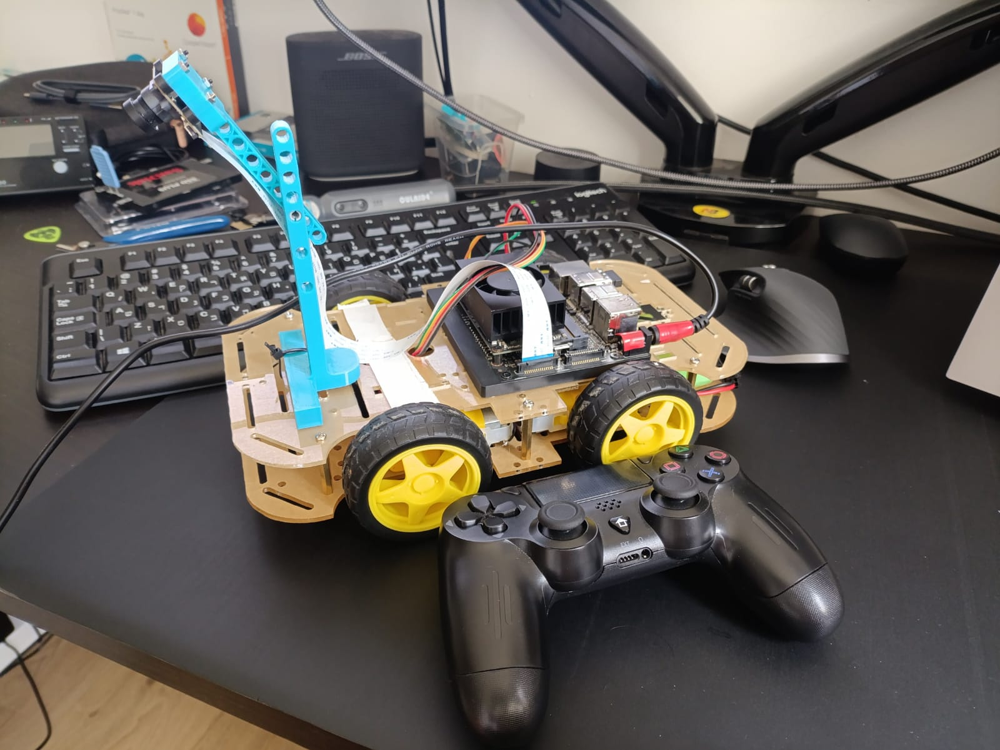

### System Monitoring and Control

**Check recording status:**
```bash
# Get current recording status and statistics
ros2 service call /recording_sta# 🚗 Autonomous Car Project - Jetson Xavier NX


A comprehensive autonomous car project built with ROS2 Foxy on NVIDIA Jetson Xavier NX. Features real-time joystick control, differential drive motor control, CSI camera integration, **intelligent joystick-triggered data recording**, **graceful HOME button shutdown**, and expandable architecture for autonomous navigation capabilities.


*The completed autonomous car with Jetson Xavier NX, 4-motor differential drive, CSI camera, and Bluetooth joystick control*

## 🎯 Project Overview

This project transforms a basic RC car into an intelligent autonomous vehicle using:
- **NVIDIA Jetson Xavier NX** for high-performance edge computing
- **ROS2 Foxy** for robust robotics software architecture
- **Differential drive control** for precise movement
- **CSI Camera integration** with hardware-accelerated pipeline
- **Intelligent joystick control** with one-button recording and graceful shutdown
- **Smart data collection system** with automatic session management and compression
- **Production-ready workflow** with complete system shutdown via HOME button
- **Modular design** ready for autonomous navigation features

## ✨ Features

- ✅ **Manual Control**: Bluetooth joystick teleoperation with Xbox/PS4 controller support
- ✅ **Motor Control**: Precise PWM-based differential drive control with 4-motor setup
- ✅ **Camera Integration**: CSI camera with GStreamer hardware acceleration and 180° flip
- ✅ **Real-time Vision**: Live camera feed publishing to ROS2 topics at 30fps
- ✅ **Intelligent Data Collection**: One-button recording with Square button, automatic session management
- ✅ **Graceful System Shutdown**: HOME button provides complete, clean system termination
- ✅ **Automatic Compression**: ZSTD compression for efficient storage of training data
- ✅ **Quality Monitoring**: Real-time FPS tracking, message counting, and session statistics
- ✅ **One-Command Launch**: Complete system startup with camera and recorder enabled by default
- ✅ **Production Workflow**: Battle-tested recording and shutdown system for serious data collection
- ✅ **Safety Systems**: Emergency stop, speed limiting, mode switching, and resource cleanup
- ✅ **Real-time Performance**: Low-latency control loop for responsive driving
- ✅ **Modular Architecture**: Clean ROS2 package structure for easy expansion
- ✅ **PWM Configuration**: Hardware PWM on both motor sides with device tree optimization
- 🚧 **Lane Detection**: OpenCV-based computer vision (in development)
- 🚧 **Autonomous Navigation**: PID control and path planning (planned)

## 🔧 Hardware Requirements

### Core Components
- **NVIDIA Jetson Xavier NX** Developer Kit
- **CSI Camera** (IMX219 or compatible) or USB webcam
- **4 DC Motors** (2 per side) with H-bridge motor drivers
- **Bluetooth Joystick** (Xbox One, PS4, or compatible)
- **Power Supply** (12V for motors, 5V for Jetson)

### Optional Components
- **IMU Sensor** for orientation tracking
- **Ultrasonic Sensors** for obstacle detection
- **Servo Motor** for camera gimbal

## 📋 Pin Configuration

### Jetson Xavier NX GPIO (BOARD numbering)

| Component | Pin | Function |
|-----------|-----|----------|
| **Left Side Motors** | 18, 16 | Direction Control |
| | 15 | PWM Speed Control |
| **Right Side Motors** | 35, 37 | Direction Control |
| | 32 | PWM Speed Control |
| **CSI Camera** | CSI Connector | Camera Interface |

> **Note**: Pins 15 and 32 are hardware PWM-capable pins on the Jetson Xavier NX. Enable PWM in device tree with `sudo /opt/nvidia/jetson-io/jetson-io.py`

## 🚀 Installation

### Prerequisites

```bash
# Install ROS2 Foxy (if not already installed)
sudo apt update
sudo apt install ros-foxy-desktop

# Install joystick support
sudo apt install ros-foxy-joy ros-foxy-teleop-twist-joy

# Install camera and vision packages
sudo apt install ros-foxy-cv-bridge ros-foxy-image-transport
sudo apt install python3-opencv

# Install GPIO library
sudo apt install python3-rpi.gpio

# Install development tools
sudo apt install python3-colcon-common-extensions

# Install data collection dependencies
sudo apt install ros-foxy-rosbag2* ros-foxy-image-view
```

### Python Dependencies

Install Python dependencies using the included requirements file:

```bash
# Install Python packages
pip3 install -r requirements.txt

# Additional system packages for data processing
pip3 install zstandard  # For compressed bag support
```

**📄 See [requirements.txt](requirements.txt) for complete dependency list**

### Setup GPIO and PWM Configuration

```bash
# Enable PWM pins in device tree
sudo /opt/nvidia/jetson-io/jetson-io.py
# Select "Configure for compatible hardware" and enable all PWM functions

# Add user to GPIO group
sudo usermod -a -G gpio $USER

# Logout and login again, or reboot
sudo reboot
```

### Clone and Build

```bash
# Create workspace
mkdir -p ~/car_ws/src
cd ~/car_ws

# Clone repository
git clone https://github.com/antonagafonov/autonomous-car-jetson-nx.git src/

# Install dependencies
rosdep install --from-paths src --ignore-src -r -y

# Build workspace
colcon build --symlink-install

# Source workspace
source install/setup.bash
echo "source ~/car_ws/install/setup.bash" >> ~/.bashrc
```

## 🚀 Usage

### Quick Start - One Command Launch

**Launch complete system (recommended - camera and recording enabled by default):**
```bash
source ~/car_ws/install/setup.bash
ros2 launch car_bringup car_manual_control.launch.py
```

**Launch with custom settings:**
```bash
# Disable camera if not needed
ros2 launch car_bringup car_manual_control.launch.py enable_camera:=false

# Disable recorder if not needed
ros2 launch car_bringup car_manual_control.launch.py enable_recorder:=false

# Conservative settings for testing
ros2 launch car_bringup car_manual_control.launch.py \
  max_linear_speed:=0.5 base_speed_scale:=40

# High performance with custom camera resolution
ros2 launch car_bringup car_manual_control.launch.py \
  camera_width:=1920 camera_height:=1080 output_width:=960 output_height:=540
```

### 🎮 Joystick Controls

| Control | Action | Description |
|---------|--------|-------------|
| **Left Stick ↕** | Forward/Backward | Move car forward or reverse |
| **Right Stick ↔** | Turn Left/Right | Steer the car |
| **X Button (PS4)** | Mode Toggle | Switch between manual/autonomous |
| **Circle Button (PS4)** | Emergency Stop | Immediate stop with toggle |
| **Square Button (PS4)** | **🎬 Start/Stop Recording** | **One-button data collection** |
| **L1 Button** | Slow Mode | Reduce speed to 30% (hold) |
| **R1 Button** | Turbo Mode | Increase speed to 150% (hold) |
| **HOME/PS Button** | **🏠 System Shutdown** | **Complete graceful system termination** |

> **🎯 Key Features**: 
> - **Square Button**: Instant recording control - press once to start, press again to stop
> - **HOME Button**: Complete system shutdown with automatic cleanup (no more Ctrl+C!)
> - **Automatic Session Management**: Recordings auto-saved with timestamps and compression

### 🎒 Intelligent Data Collection for Machine Learning

The project includes a production-ready data collection system with intelligent joystick-triggered recording for training autonomous driving models.

#### One-Button Recording System

**Instant recording while driving:**
```bash
# Launch system (camera and recorder enabled by default)
ros2 launch car_bringup car_manual_control.launch.py

# Press Square button to start recording
# Drive the car to collect training data  
# Press Square button again to stop recording
# Files automatically saved to ~/car_datasets/behavior_YYYYMMDD_HHMMSS/
```

#### Intelligent Recording Features

- ✅ **One-Button Operation**: Square button starts/stops recording instantly
- ✅ **Automatic Session Management**: Timestamped sessions with unique names
- ✅ **Real-Time Quality Monitoring**: Live FPS tracking and message counting
- ✅ **Automatic Compression**: ZSTD compression for storage efficiency
- ✅ **Smart Auto-Stop**: Prevents empty recordings on inactivity
- ✅ **Emergency Integration**: Recording stops automatically with emergency stop
- ✅ **Session Statistics**: Comprehensive metadata with system info
- ✅ **Recording Status Display**: Visual feedback with recording stats every 30 seconds
- ✅ **Graceful Shutdown Integration**: Clean recording stop during system shutdown

#### Complete System Shutdown

**Perfect workflow termination:**
```bash
# When finished collecting data, press HOME button
# System performs:
# 1. Stops active recording gracefully
# 2. Saves all session metadata  
# 3. Terminates all nodes cleanly
# 4. Releases hardware resources (GPIO, camera)
# 5. Complete system shutdown

# Optional cleanup if needed:
car_cleanup  # Alias for any remaining processes
```

#### Manual Recording (Alternative)

```bash
# Record specific topics manually
mkdir -p ~/training_data
cd ~/training_data

ros2 bag record -o drive_session_001 \
  /camera/image_raw \
  /cmd_vel_manual \
  /joy \
  /recording_trigger

# Or use the smart recorder service
ros2 service call /start_recording std_srvs/srv/SetBool "data: true"
ros2 service call /stop_recording std_srvs/srv/Trigger
```

#### Extract Training Data

Use the integrated bag data extractor to convert ROS2 bags into ML-ready format:

```bash
# Extract from joystick-recorded sessions
python3 bag_collect.py ~/car_datasets/behavior_20240115_103000

# Extract from specific .db3 file
python3 bag_collect.py ~/car_datasets/behavior_20240115_103000/rosbag2_*.db3

# Specify custom output directory
python3 bag_collect.py ~/car_datasets/behavior_20240115_103000 -o ~/ml_datasets/session_001

# Extract multiple sessions
for bag in ~/car_datasets/behavior_*; do
    python3 bag_collect.py "$bag"
done
```

#### Extracted Data Structure

The extractor creates an organized dataset:

```
behavior_20240115_103000_extracted/
├── images/               # Camera images for visual input
│   ├── image_000000.png  # Sequential PNG images (640x480)
│   ├── image_000001.png
│   └── ...
├── data/                 # Command and sensor data
│   ├── images.csv        # Image metadata with timestamps
│   ├── cmd_vel_manual.csv # Manual commands (training labels)
│   ├── joy.csv           # Raw joystick input
│   ├── recording_trigger.csv # Recording state data
│   └── *.json           # Same data in JSON format
├── metadata/
│   ├── extraction_summary.json  # Dataset statistics
│   └── metadata.json    # Recording session info
└── rosbag2_metadata.yaml # Original ROS2 bag metadata
```

#### Production-Ready Session Statistics

Each recording automatically generates comprehensive statistics:

```json
{
  "session_info": {
    "session_name": "behavior_20250629_224931",
    "duration_seconds": 28.8,
    "recording_trigger_mode": true,
    "start_time": "2025-06-29T22:49:31.123456",
    "end_time": "2025-06-29T22:50:00.456789"
  },
  "statistics": {
    "total_images": 470,
    "total_commands": 184,
    "average_fps": 20.1,
    "storage_size_mb": 45.2,
    "compression_format": "zstd"
  },
  "system_info": {
    "ros_distro": "foxy",
    "hostname": "jetson-nx",
    "platform": "Linux"
  }
}
```

#### Real-Time Monitoring

During recording, the system provides live feedback:
```
📊 Recording stats: 15.3s, 287 images, 156 commands, 18.8 fps, Trigger: 🟢 ACTIVE
```

### Camera System

**Monitor camera feed:**
```bash
# View live camera stream
ros2 run rqt_image_view rqt_image_view

# Check camera status
ros2 topic hz /camera/image_raw
ros2 topic info /camera/image_raw

# Monitor system performance
ros2 topic echo /rosout | grep camera
```

### System Monitoring

**Check recording status:**
```bash
# Get current recording status
ros2 service call /recording_status std_srvs/srv/Trigger

# Monitor recording trigger
ros2 topic echo /recording_trigger

# List recorded sessions
ls -la ~/car_datasets/
```

### Manual Launch (Individual Nodes)

**Terminal 1: Motor Controller**
```bash
source ~/car_ws/install/setup.bash
ros2 run car_drivers motor_controller
```

**Terminal 2: Camera Node**
```bash
source ~/car_ws/install/setup.bash
ros2 run car_perception camera_node
```

**Terminal 3: Joystick Input**
```bash
source ~/car_ws/install/setup.bash
ros2 run joy joy_node
```

**Terminal 4: Joystick Controller**
```bash
source ~/car_ws/install/setup.bash
ros2 run car_teleop joystick_controller
```

**Terminal 5: Command Relay**
```bash
source ~/car_ws/install/setup.bash
ros2 run car_teleop cmd_relay
```

**Terminal 6: Smart Recorder**
```bash
source ~/car_ws/install/setup.bash
ros2 run data_collect bag_collect
```

### Command Line Control

```bash
# Move forward at 20cm/s
ros2 topic pub /cmd_vel geometry_msgs/Twist '{linear: {x: 0.2}, angular: {z: 0.0}}' --once

# Stop the car
ros2 topic pub /cmd_vel geometry_msgs/Twist '{linear: {x: 0.0}, angular: {z: 0.0}}' --once

# Turn left while moving forward
ros2 topic pub /cmd_vel geometry_msgs/Twist '{linear: {x: 0.2}, angular: {z: 0.5}}' --once

# Start/stop recording programmatically
ros2 topic pub /recording_trigger std_msgs/Bool "data: true" --once
ros2 topic pub /recording_trigger std_msgs/Bool "data: false" --once
```

## 📡 ROS2 Architecture

### Topics

| Topic | Type | Description |
|-------|------|-------------|
| `/joy` | `sensor_msgs/Joy` | Raw joystick input |
| `/cmd_vel_manual` | `geometry_msgs/Twist` | Manual control commands |
| `/cmd_vel` | `geometry_msgs/Twist` | Final motor commands |
| `/autonomous_mode` | `std_msgs/Bool` | Current operation mode |
| `/camera/image_raw` | `sensor_msgs/Image` | Live camera feed (640x480 @ 30fps) |
| `/recording_trigger` | `std_msgs/Bool` | **Recording state control** |

### Nodes

| Node | Package | Function |
|------|---------|----------|
| `motor_controller` | `car_drivers` | GPIO motor control |
| `camera_node` | `car_perception` | CSI camera interface with GStreamer |
| `joystick_controller` | `car_teleop` | Joystick input processing with recording control |
| `cmd_relay` | `car_teleop` | Command routing |
| `bag_collect` | `data_collect` | **Smart recording with joystick trigger** |
| `joy_node` | `joy` | Joystick hardware interface |

### Services

| Service | Type | Description |
|---------|------|-------------|
| `/start_recording` | `std_srvs/SetBool` | Start/stop recording programmatically |
| `/stop_recording` | `std_srvs/Trigger` | Stop current recording |
| `/recording_status` | `std_srvs/Trigger` | Get recording status and statistics |

### Data Collection Tools

| Tool | Function |
|------|----------|
| **Joystick Recording** | Press Square button to record training data |
| `bag_collect.py` | Extract and organize bag data for ML |
| `ros2 bag record` | Manual recording of ROS2 topics |
| **Smart Recorder** | Automatic session management and quality monitoring |

## ⚙️ Configuration

### Motor Controller Parameters

```bash
# Adjust speed scaling (0-100%)
ros2 param set /motor_controller base_speed_scale 60

# Set maximum speed (m/s)
ros2 param set /motor_controller max_speed 0.8

# Calibrate steering offset
ros2 param set /motor_controller steering_offset 0.05

# Change GPIO mode (BOARD/BCM)
ros2 param set /motor_controller pin_mode BOARD
```

### Camera Node Parameters

```bash
# Set camera resolution (native sensor resolution)
ros2 param set /camera_node camera_width 1280
ros2 param set /camera_node camera_height 720

# Set output resolution
ros2 param set /camera_node output_width 640
ros2 param set /camera_node output_height 480

# Set frame rate
ros2 param set /camera_node framerate 30

# Set flip method (0=none, 1=90CW, 2=180, 3=90CCW)
ros2 param set /camera_node flip_method 2
```

### Recording System Parameters

```bash
# Set storage location
ros2 param set /bag_collect storage_base_path "~/car_datasets"

# Set minimum recording duration (seconds)
ros2 param set /bag_collect min_recording_duration 10.0

# Set inactivity timeout (seconds)
ros2 param set /bag_collect inactive_timeout 30.0

# Enable/disable auto-stop on inactivity
ros2 param set /bag_collect auto_stop_on_inactive true
```

## 🎯 Workflow for Machine Learning

### 1. Collect Training Data
```bash
# Start system
ros2 launch car_bringup car_manual_control.launch.py

# Drive manually and press Square to record interesting driving segments
# Each recording session automatically saved with timestamp
```

### 2. Extract and Organize Data
```bash
# Extract all recorded sessions
for session in ~/car_datasets/behavior_*; do
    python3 bag_collect.py "$session"
done

# Combine multiple sessions into training set
mkdir -p ~/ml_training_data
cp -r ~/car_datasets/behavior_*_extracted/* ~/ml_training_data/
```

### 3. Train Your Model
```python
# Example: Load extracted data for behavior cloning
import pandas as pd
import cv2
import numpy as np

# Load training data
commands = pd.read_csv('~/ml_training_data/data/cmd_vel_manual.csv')
images = pd.read_csv('~/ml_training_data/data/images.csv')

# Load images and commands for training
# Your neural network training code here...
```

### 4. Deploy Autonomous Mode
```bash
# Your trained model can publish to /cmd_vel when autonomous_mode is True
# The system will automatically switch between manual and autonomous control
```

## 🔧 Troubleshooting

### Camera Issues
```bash
# Test camera pipeline manually
gst-launch-1.0 nvarguscamerasrc ! \
'video/x-raw(memory:NVMM), width=1280, height=720, format=NV12' ! \
nvvidconv ! 'video/x-raw, format=RGBA' ! glimagesink

# Check camera permissions
ls -la /dev/video*
sudo usermod -a -G video $USER
```

### Recording Issues
```bash
# Check if bag_collect node is running
ros2 node list | grep bag_collect

# Monitor recording status
ros2 topic echo /recording_trigger
ros2 service call /recording_status std_srvs/srv/Trigger

# Check storage space
df -h ~/car_datasets
```

### Joystick Issues
```bash
# Test joystick connection
sudo jstest /dev/input/js0

# Check joystick permissions
ls -la /dev/input/js*
sudo usermod -a -G input $USER

# Monitor joystick data
ros2 topic echo /joy
```

### GPIO/Motor Issues
```bash
# Check GPIO permissions
sudo usermod -a -G gpio $USER

# Test PWM availability
ls -la /sys/class/pwm/

# Enable PWM in device tree
sudo /opt/nvidia/jetson-io/jetson-io.py
```

## 📈 Performance Optimization

### High Performance Settings
```bash
# Launch with performance settings
ros2 launch car_bringup car_manual_control.launch.py \
  camera_width:=1920 camera_height:=1080 \
  output_width:=640 output_height:=480 \
  framerate:=30 \
  max_linear_speed:=1.0

# Enable Jetson performance mode
sudo nvpmodel -m 0
sudo jetson_clocks
```

### Cleanup

echo 'alias car_cleanup="pkill -9 -f joystick_controller; pkill -9 -f joy_node; pkill -9 -f motor_controller; pkill -9 -f camera_node; pkill -9 -f bag_collect; pkill -9 -f cmd_relay; echo '✅ All car processes cleaned up'"' >> ~/.bashrc

car_cleanup

### Storage Optimization
```bash
# Enable compression for bag files (if supported)
# The system automatically detects and enables zstd compression

# Clean old recordings
find ~/car_datasets -name "behavior_*" -mtime +30 -exec rm -rf {} \;

# Monitor storage usage
du -sh ~/car_datasets/*
```

## 🚧 Future Roadmap

- [ ] **Lane Detection**: OpenCV-based lane following
- [ ] **Object Detection**: YOLO-based obstacle detection
- [ ] **Autonomous Navigation**: GPS waypoint following
- [ ] **SLAM Integration**: Mapping and localization
- [ ] **Web Interface**: Remote monitoring and control
- [ ] **ROS2 Galactic/Humble**: Upgrade to newer ROS2 versions
- [ ] **Docker Support**: Containerized deployment
- [ ] **CI/CD Pipeline**: Automated testing and deployment

## 📄 License

This project is licensed under the MIT License - see the [LICENSE](LICENSE) file for details.

## 🤝 Contributing

Contributions are welcome! Please feel free to submit a Pull Request. For major changes, please open an issue first to discuss what you would like to change.

## 📧 Contact

For questions, issues, or suggestions, please open an issue on GitHub or contact the maintainers.

---

**Happy autonomous driving! 🚗💨**


